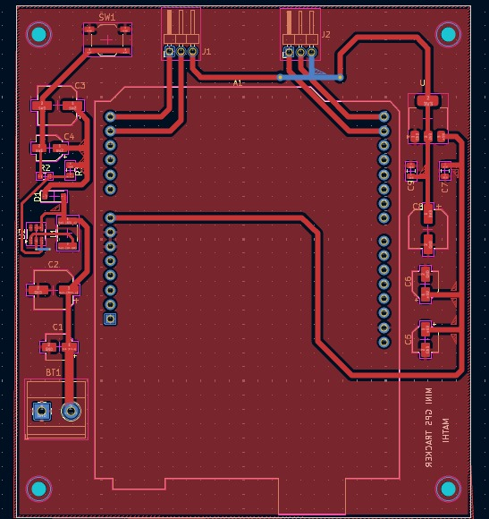

# GPS Tracker – PCB Design (Arduino)

## 📌 Overview
This project is a **PCB design for a GPS Tracker system** based on **Arduino**.  
The focus of this repository is **hardware design only**, including:

- Schematic design  
- PCB layout  
- 3D PCB visualization  

The PCB is designed using **KiCad** and supports a **GPS module, OLED display, battery power, and voltage regulation**.

---

## 🛠 Tools Used
- **KiCad** – Schematic, PCB Layout & 3D View

---

## 🔧 PCB Design Features
- **Arduino Interface**  
  Header layout compatible with Arduino Uno / Nano

- **GPS Module Connector (UART)**  
  Supports NEO-6M / NEO-8M GPS modules

- **OLED Display Connector (I2C)**  
  SDA & SCL routed with proper pull routing

- **Boost Converter (MT3608)**  
  Battery voltage boosted to +5V

- **3.3V Regulator (AMS1117-3.3)**  
  Dedicated 3.3V rail for GPS and OLED

- **Battery Power Input**  
  Designed for portable operation

- **Filtering & Protection**  
  Schottky diode, inductor, decoupling capacitors

---

## 📂 Repository Structure
- **schematic And BOM/** → schematic diagram (PDF) And BOM file.
- **gerber and Dril files/** → Fabrication-ready files for PCB manufacturing  
- **3D View/** → project 3D view images.  

---

## ⚡ Power Architecture (Hardware)
- **Battery Input → MT3608 Boost Converter → +5V**
- **+5V → Arduino Header**
- **+5V → AMS1117 → +3.3V**
- **+3.3V → GPS & OLED Connectors**

⚠️ **Usage Note**  
- USB power and battery power should not be used simultaneously.

---

### 🟢 Schematic Diagram
📄 [Download Schematic PDF](Schematic_and_BOM/GPS_TRACKER_MINI-SCHEMATIC.pdf)

### 🟣 Layout View

### 🟠 3D View

 

---

## 📜 License
This PCB design is shared for **educational and learning purposes**.
